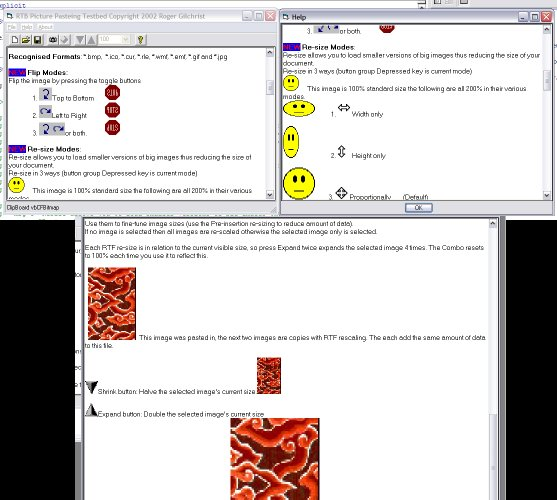



## RichTextBox picture import, resize, reorient, crop and export

### Description

Ver 4 Update on ClsPictureLoader. NEW Crop images before pasteing to RichTExtBox. OLD (But improved)Load picture to RichTextBox with resizing (width, height or proportional). Flip image Left-Right and Top-Bottom. Re-size inserted pictures proportionally with the class (better than doing it by the built-in RichTextBox behaviour). Export RTF document images to BMP. Improved interface with toolbars. Apologies to VER3 downloaders, I forgot that SavePicture is only BMP.
 
### More Info
 

             |
---                |---
**Submitted On**   |2002-12-04 14:10:42
**By**             |[Roger Gilchrist](https://github.com/Planet-Source-Code/PSCIndex/blob/master/ByAuthor/roger-gilchrist.md)
**Level**          |Intermediate
**User Rating**    |5.0 (30 globes from 6 users)
**Compatibility**  |VB 6\.0
**Category**       |[Custom Controls/ Forms/  Menus](https://github.com/Planet-Source-Code/PSCIndex/blob/master/ByCategory/custom-controls-forms-menus__1-4.md)
**World**          |[Visual Basic](https://github.com/Planet-Source-Code/PSCIndex/blob/master/ByWorld/visual-basic.md)
**Archive File**   |[RichTextBo1507891242002\.zip](https://github.com/Planet-Source-Code/roger-gilchrist-richtextbox-picture-import-resize-reorient-crop-and-export__1-41311/archive/master.zip)

